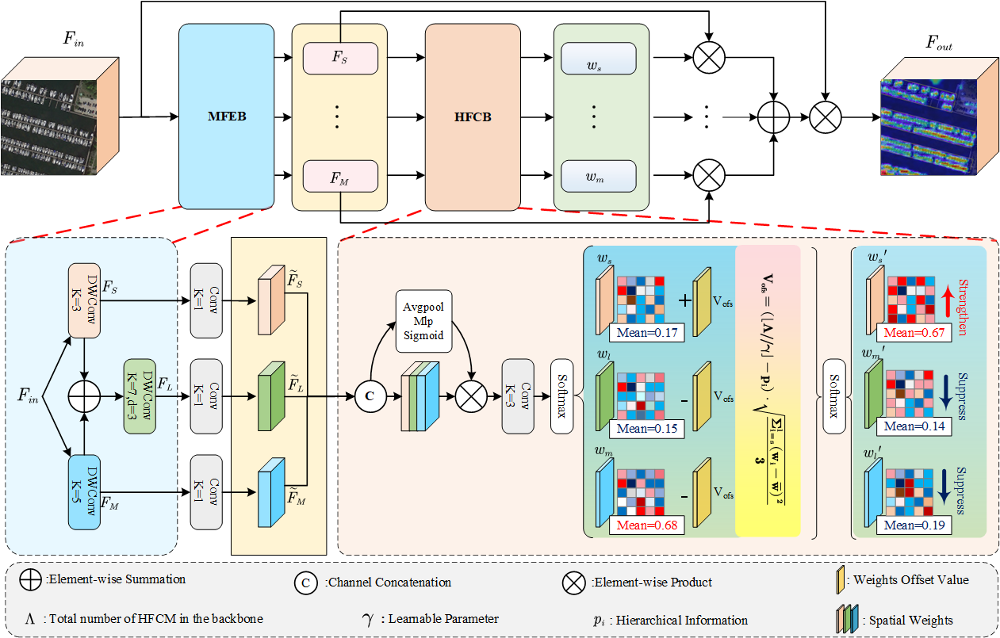

<div align="center">
  
  <div>&nbsp;</div>
  <div align="center">
    <b><font size="5">OpenMMLab website</font></b>
    <sup>
      <a href="https://openmmlab.com">
        <i><font size="4">HOT</font></i>
      </a>
    </sup>
    &nbsp;&nbsp;&nbsp;&nbsp;
    <b><font size="5">OpenMMLab platform</font></b>
    <sup>
      <a href="https://platform.openmmlab.com">
        <i><font size="4">TRY IT OUT</font></i>
      </a>
    </sup>
  </div>
  <div>&nbsp;</div>


## Installation

MMRotate depends on [PyTorch](https://pytorch.org/), [MMCV](https://github.com/open-mmlab/mmcv) and [MMDetection](https://github.com/open-mmlab/mmdetection).
Below are quick steps for installation.
Please refer to [Install Guide](https://mmrotate.readthedocs.io/en/latest/install.html) for more detailed instruction.

```shell
conda create -n open-mmlab python=3.7 pytorch==1.7.0 cudatoolkit=10.1 torchvision -c pytorch -y
conda activate open-mmlab
pip install openmim
mim install mmcv-full
mim install mmdet
git clone https://github.com/open-mmlab/mmrotate.git
cd mmrotate
pip install -r requirements/build.txt
pip install -v -e .
```

## Get Started

Please see [get_started.md](docs/en/get_started.md) for the basic usage of MMRotate.
We provide [colab tutorial](demo/MMRotate_Tutorial.ipynb), and other tutorials for:

- [learn the basics](docs/en/intro.md)
- [learn the config](docs/en/tutorials/customize_config.md)
- [customize dataset](docs/en/tutorials/customize_dataset.md)
- [customize model](docs/en/tutorials/customize_models.md)
- [useful tools](docs/en/tutorials/useful_tools.md)

## Model Zoo

Results and models are available in the *README.md* of each method's config directory.
A summary can be found in the [Model Zoo](docs/en/model_zoo.md) page.

