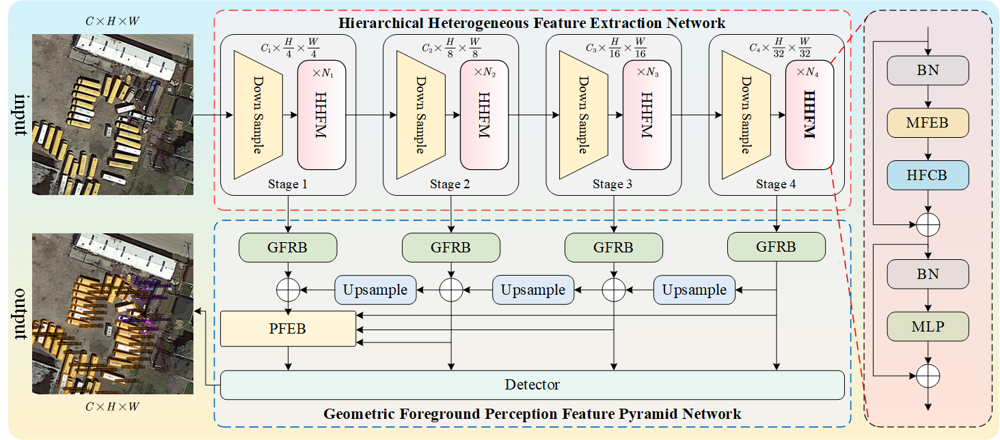
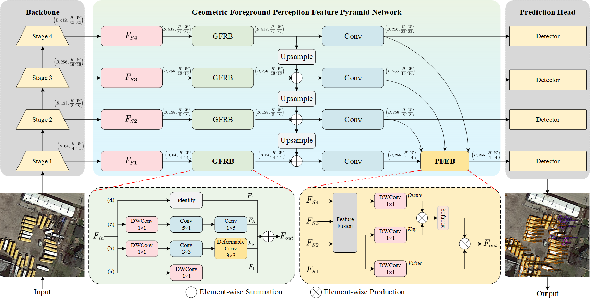
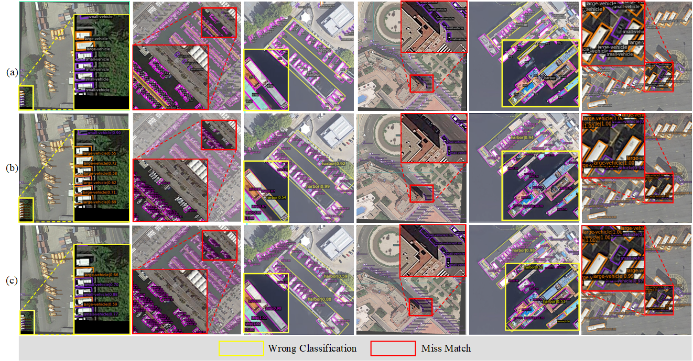
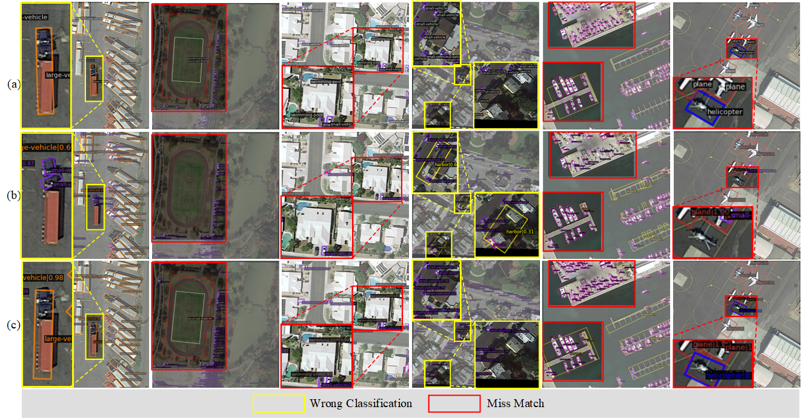
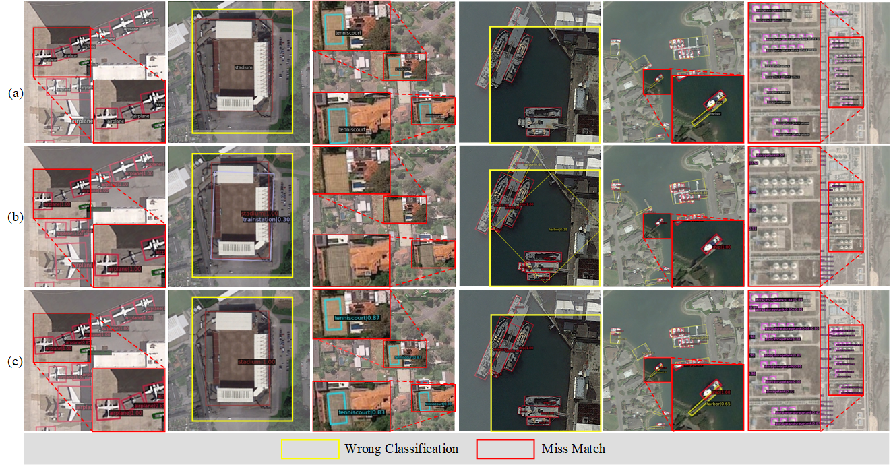
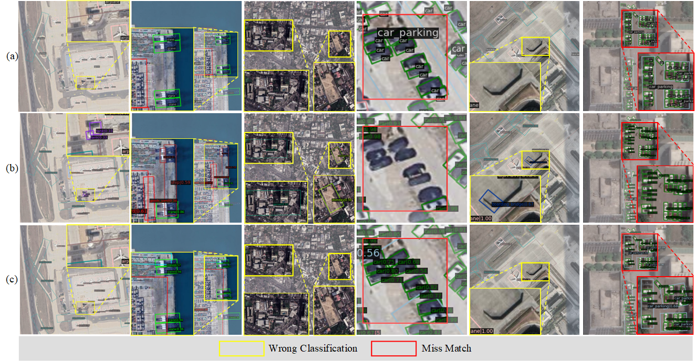

# Hierarchical Synergy Geometric Foreground Perception Network for Remote Sensing Object Detection


## Abstract
Recently, deep learning-based remote sensing object detection has been widely explored and obtained remarkable performance. However, most existing multi-scale feature extraction methods neglect exploring the interfering representation of different hierarchical features in the backbone, which is crucial for learning more discriminative features. Moreover, FPN and its variants have difficulty in effectively perceiving the pose and salient information of remote sensing objects, leading to reduced detection accuracy. To address these issues, we propose a Hierarchical Synergy Geometric Foreground Perception Network (HSGFP-Net) for remote sensing object detection. Specifically,  a Hierarchical Synergistic Features Module (HSFM)  is proposed to achieve the complementary of deep and shallow layers information within the backbone, improving the discriminative ability of features. Furthermore, a Geometric Foreground Perception Feature Pyramid Network (GFP-FPN) is developed to refine geometric shapes and enhance foreground contents, providing more precise feature representations for objects, particularly small objects. Experimental results on four challenging remote sensing object detection datasets demonstrate that our HSGFP-Net achieves state-of-the-art performance.

## News!

- 2024-9-24 This research has been submitted as a paper to IEEE TGRS. the code from the paper has been published on this page (we will continue to tweak and optimize it).

## HSFM


## GFP-FPN


## Installation

HSGFPNet depends on [MMRotate](https://github.com/open-mmlab/mmrotate),[PyTorch](https://pytorch.org/), [MMCV](https://github.com/open-mmlab/mmcv) and [MMDetection](https://github.com/open-mmlab/mmdetection).
Below are quick steps for installation.
Please refer to [Install Guide](https://mmrotate.readthedocs.io/en/latest/install.html) for more detailed instruction.

```shell
conda create -n open-mmlab python=3.7 pytorch==1.7.0 cudatoolkit=10.1 torchvision -c pytorch -y
conda activate open-mmlab
pip install openmim
mim install mmcv-full
mim install mmdet
git clone https://github.com/open-mmlab/mmrotate.git
cd mmrotate
pip install -r requirements/build.txt
pip install -v -e .
```

## Get Started

Please see [get_started.md](docs/en/get_started.md) for the basic usage of MMRotate.
Openmmlab provide [colab tutorial](demo/MMRotate_Tutorial.ipynb), and other tutorials for:

- [learn the basics](docs/en/intro.md)
- [learn the config](docs/en/tutorials/customize_config.md)
- [customize dataset](docs/en/tutorials/customize_dataset.md)
- [customize model](docs/en/tutorials/customize_models.md)
- [useful tools](docs/en/tutorials/useful_tools.md)

## Results
[HSFEN pre-trained 300epoch weights on ImageNet-1k](https://pan.baidu.com/s/1edUqy3Enz6cbbwdRjE3MnA) extraction code: aaa0

| Dataset | Train | Val | Test | Multi-Scale|Single-Scale|epoch|Lowest mAP|Best mAP |
| ------------ | ------- | ------ | -------- | ------- | ------ | ------- | ----- | ------ |
|DOTA-v1.0 | train+val | val | test | no | yes | 12 | 79.55 |80.67 |
|DOTA-v1.0 | train+val | val | test | yes | no | 12 | 80.23 |81.78 |
|DOTA-v1.5 | train+val | val | test | no | yes | 12 | 74.37 |77.54 |
|DIOR | train+val | test |test| no | yes | 12 | 71.11 |72.34 |
|STAR|train+val | val |test | no | yesy |24| 37.47 |39.90 |

## Visulization

### Heatmap Comparisons of LSKNet and HSGFP-Net in shallow layer at the bachone.
- (a) input RGB image
- (b) LSKNet
- (c) HSGFP-Net


### Heatmap Comparisons of LSKNet and HSGFP-Net in deep layer at the bachone.
- (a) input RGB image
- (b) LSKNet
- (c) HSGFP-Net


### Heatmap Comparisons of FPN and GFP-FPN before the final detection.
- (a) input RGB image
- (b) FPN
- (c) GFP-FPN


### Results on  DOTA-v1.0


### Results on  DOTA-v1.5


### Results on  DIOR


### Results on  STAR


## Abaout the code and weights

The code that has been published so far has been reorganized according to the naming convention of the modules in the paper, and all the weights used in the experiments will be released after we reorganize the experiments.


